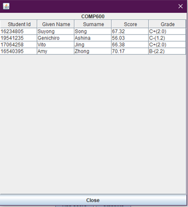

<!--
 * @Author: Tai Zhang
-->

# 2020_S2_COMP603_Java
This is a Java project for my COMP603 paper.  
This is a Student Management System, which was implemented by Java.  
It gives a platform to input students' scores and caltualate the GPA etc.  

One thing you need to know, this application is not a formal GPA calcultator, as I just randomly gave the paper points.  
And the courses code are CASE SENSITIVE. 

**Advanced Features**
This project allows user to manage students’ performance in difference courses. User or lecturer can register students’ courses performance to his/her students by adding course and score directly to a certain student or adding student and score to different courses. Therefore, the project will automatically calculate the GPA for each student. (excessive data may cause longer loading time)
For avoiding the mistakes, user only can input correct existed Student ID and correct existed Course Code in correct format, when user register performance. (e.g. Student ID: 17970814, Course Code: COMP600)
User also able to manage the information in ascending or descending ways by clicking the subtitles (e.g. GPA, Surname and Student Id). Besides, the project also shows the number of courses that a student under taken.  
  
.png)  
Run PDC_Project2.java, you will see a graphic user interface as the Exhibit-1.  
  
At the top of this window, user can choose the list of students or the list of the courses.  
In the list of student window, administrator is able to see the courses of a student after selecting the student and click the “Courses” button (as the Exhibit-2 and Exhibit-3), and add new course score after click “Add Score” button (Exhibit-4 and Exhibit-5). User must input the correct course code with the correct format e.g. COMP600  
  
  
  
These are the windows that user will see when input a new score for a student. The language of text in these buttons are supposed to be the same as devices’ language.  
  
  
  
The new score for COMP600 exists.  
  
If user input wrong code, the window will show that the course does not exist.  
  

In the Course window, user can manage students by using course code.   
Choose a course and click “Add Score”, it will allow user inputs the score of the selected course to an existed student. User must input an existed student.  
Select a course and click “Students”, administrator can get a widow with all students who is under this course (Exhibit-4).   
  

  
  
  
  
  
There are the test cases examples  
  
  
Hibernate is used for the database. Hibernate is good for different SQL, but might need longer time in compiling.  